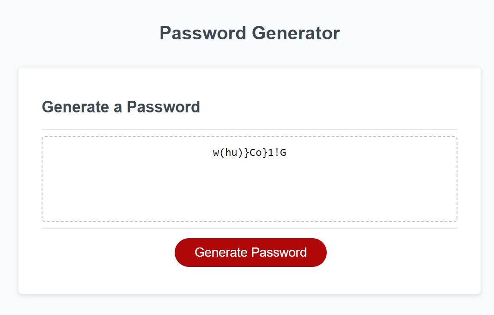
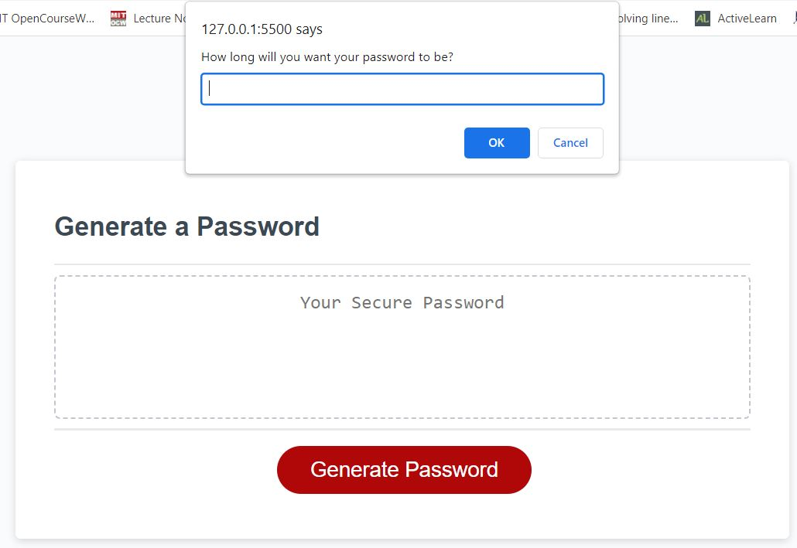

# Challenge 5 Password Generator

## Description

In this challenge, I used the concepts I had learnt on functions to complete the activity. This activity was to create an application to generate a random password based in certain criteria selected by the user. I was provided with a stater code and I had to modify the javascript code. 

The following image shows the web application's appearance and functionality:

## steps taken

1. Created a new GitHub repo called `Password Generator`. Then, cloned it to my computer.

2. Copied the starter files into my local git repository.

## Tasks

1. Generate a password when the button is clicked

2. Present a series of prompts for password criteria

3. Ensure the password length is atleast 10 and not more than 64

4. Ensure to have all the character types
    * Lowercase
    * Uppercase
    * Numeric
    * Special characters ($@%&*, etc)

5. Code should validate for each input and at least one character type should be selected.

6. Once prompts are answered then the password should be generated and displayed in an alert or written to the page

## Screenshots
Working example of a generated password

Example of one of the user prompts

## Link to deployed app

[Link](https://princeolubari.github.io/Challenge5RandomPasswordGenerator/)

